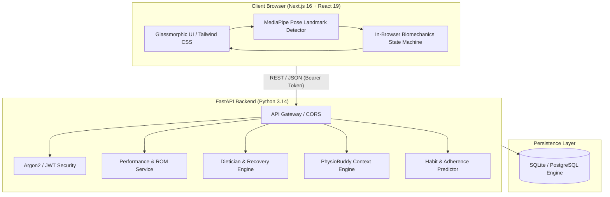

# AI_GYM_FITNESS & ASSISTANT
### PhysioRecover AI — Clinical Physical Therapy, Joint ROM Biomechanics & Smart Gym Assistant

**Author:** P. Durga Naik  
**Academic / Capstone Edition:** 2.0.0  
**License:** MIT  

---

## 1. Project Title
**AI_GYM_FITNESS & ASSISTANT (PhysioRecover AI Edition)**  
*Next-Generation Markerless Joint Range of Motion (ROM) Assessment, Injury Prevention, Anti-Inflammatory Nutrition & Physical Rehabilitation Coach.*

---

## 2. Problem Statement
Traditional physical therapy and gym rehabilitation face several critical challenges:
1. **Lack of Continuous Clinical Oversight:** Patients perform rehabilitation exercises at home with zero real-time feedback, often leading to improper mechanics and reinjury.
2. **Expensive Hardware Requirements:** Clinical motion capture laboratories and wearable sensor suits cost thousands of dollars, making high-precision biomechanics inaccessible to everyday patients and students.
3. **Inaccurate Self-Reporting:** Patients struggle to accurately record joint angles, repetition depths, movement cadence, and adherence.
4. **Disconnected Recovery Ecosystems:** Exercise tracking, anti-inflammatory nutrition, and recovery guidance are fragmented across different apps without context-aware cohesion.

---

## 3. Objective
The primary objective of **AI_GYM_FITNESS & ASSISTANT** is to democratize clinical biomechanics and rehabilitation tracking through consumer webcams:
- **Markerless Joint Tracking:** Calculate continuous angles for knee flexion/extension, elbow flexion, hip depth, and shoulder elevation at 30+ FPS without external hardware.
- **Biomechanical Safety & Injury Prevention:** Detect dangerous movement patterns (such as knee valgus collapse, shallow repetitions, and uncontrolled eccentric velocities) and deliver immediate visual/speech cues.
- **Holistic Recovery Optimization:** Combine joint rehabilitation protocols with targeted anti-inflammatory nutrition planning, habit adherence tracking, and conversational AI guidance.
- **Frictionless Local Execution:** Provide seamless out-of-the-box execution for students and evaluators using automatic SQLite database fallback and zero external dependencies.

---

## 4. Features

### A. Live Rehab & Form Coach (`/workout`)
- **Real-Time Angle Telemetry:** Uses 33 anatomical landmarks to calculate precise joint angles (Knee, Elbow, Shoulder) in real time.
- **Finite State Machine (FSM):** Debounced multi-stage state transitions (`READY` -> `UP` -> `DESCENDING` -> `BOTTOM` -> `ASCENDING` -> `COMPLETED`) preventing false positives.
- **Safety Biomechanics & Valgus Protection:** Flags knee inward collapse during lower-limb recovery exercises.
- **Interactive Simulation Controls:** Allows demonstration of full reps, shallow attempts, and form faults even in test environments without a camera.

### B. Rehabilitation Protocols & Planner (`/planner`)
- Structured clinical regimens for:
  - Knee Stability & Patellar Tracking
  - Shoulder Scapular Mobility & Rotator Cuff Recovery
  - Hip & Lower Back Decompression
  - Functional Range of Motion Conditioning

### C. Anti-Inflammatory & Recovery Nutrition (`/nutrition`)
- Tailored macronutrient and micronutrient profiles promoting cellular repair and collagen synthesis.
- Automated grocery list derivation categorized into produce, protein, healthy fats, and recovery supplements.
- Deterministic expert dietician engine with optional Gemini/OpenAI LLM enhancement.

### D. PhysioBuddy 24/7 AI Companion (`/buddy`)
- Contextual recovery companion aware of the trainee's recent joint scores, recurring movement issues, and nutrition logs.
- Evidence-based advice for muscle soreness, pain vs. fatigue distinction, and rehabilitation pacing.

### E. Biomechanics & Mobility Analytics (`/analytics` & `/reports`)
- Joint excursion distributions, stability metrics, cadence symmetry, and session completion compliance.
- Exportable clinical telemetry summaries.

---

## 5. Technologies Used

### Frontend
- **Framework:** Next.js 16 (App Router)
- **UI Library:** React 19 & Tailwind CSS 4
- **Computer Vision:** Google MediaPipe Pose (33 3D landmarks via browser WebAssembly)
- **Icons & Typography:** Geist font family, custom SVG biomechanical overlays, glassmorphic UI components

### Backend
- **Framework:** FastAPI (Python 3.10+)
- **ORM & Database:** SQLAlchemy 2.0 with automatic dual-engine (SQLite for local zero-config runs, PostgreSQL for production)
- **Security:** Password hashing with Argon2 via `pwdlib`, stateless authentication with PyJWT
- **Validation:** Pydantic v2 & Email-Validator
- **Machine Learning / Analytics:** NumPy, Scikit-Learn, SciPy

---

## 6. System Architecture



---

## 7. Project Workflow

1. **Patient Registration & Onboarding:**
   - Trainee registers an account and defines their height, weight, activity baseline, and primary recovery/fitness goal.
2. **Live Joint ROM Calibration:**
   - The user opens `/workout`, selects a validated exercise protocol, and allows camera access.
   - The system verifies body visibility and runs a 3-frame neutral calibration to establish zero-strain baseline extension.
3. **Continuous Angle Excursion & Safety Feedback:**
   - As repetitions are performed, MediaPipe calculates joint angles at 30 FPS.
   - Audio and visual alerts guide the user when movement is too shallow or when valgus collapse occurs.
4. **Session Telemetry Persistence:**
   - Upon completion, metrics (average ROM, minimum angle, tempo, stability, valgus flags) are transmitted to `/workouts/sessions`.
5. **Holistic Recovery Support:**
   - The user consults PhysioBuddy for soreness management, generates recovery meal plans under `/nutrition`, and reviews progress charts under `/analytics`.

---

## 8. Folder Structure

```text
ai-fitness-assistant/
├── backend/
│   ├── auth/                      # Password hashing & JWT token generators
│   ├── models/                    # SQLAlchemy database entities (User, Workout, Nutrition, etc.)
│   ├── routers/                   # FastAPI endpoint controllers
│   ├── schemas/                   # Pydantic data validation schemas
│   ├── services/                  # Business logic (PhysioBuddy, Dietician, Performance)
│   ├── venv/                      # Dedicated Python virtual environment
│   ├── create_tables.py           # Database migration & initialization
│   ├── database.py                # Dual PostgreSQL / SQLite connection engine
│   ├── main.py                    # FastAPI server entrypoint
│   ├── requirements.txt           # Python dependency specifications
│   └── seed_exercises.py          # Rehabilitation & fitness exercise seeder
├── frontend/
│   ├── public/                    # Static icons & vectors
│   ├── src/
│   │   ├── api/                   # API client configuration
│   │   ├── app/                   # Next.js App Router pages
│   │   │   ├── analytics/         # Mobility & recovery charts
│   │   │   ├── buddy/             # PhysioBuddy AI conversation interface
│   │   │   ├── dashboard/         # Patient/trainee care portal
│   │   │   ├── habit/             # Adherence & consistency tracking
│   │   │   ├── history/           # Completed session logs
│   │   │   ├── login/             # User sign-in
│   │   │   ├── nutrition/         # Anti-inflammatory meal planning
│   │   │   ├── planner/           # Rehabilitation protocols
│   │   │   ├── profile/           # Biometric & goal settings
│   │   │   ├── register/          # Account registration
│   │   │   ├── reports/           # Clinical recovery intelligence
│   │   │   └── workout/           # Real-time webcam pose & ROM coach
│   │   └── components/            # Reusable Navbar, HUD & Floating Buddy
│   ├── package.json               # Node.js dependencies
│   └── tsconfig.json              # TypeScript configuration
├── ml/
│   └── pose/                      # Standalone OpenCV & MediaPipe Python scripts
├── PROJECT_STATE.md               # Current engineering state & log
└── README.md                      # Complete system documentation (by P. Durga Naik)
```

---

## 9. Installation Steps

### Prerequisites
- Python 3.10 or higher
- Node.js 18 or higher (Node v20+ recommended)
- Git

### Step 1: Clone or Navigate to the Repository
```bash
cd "C:\Users\Durga Naik\.gemini\antigravity\scratch\ai-fitness-assistant"
```

### Step 2: Backend Setup
```bash
cd backend
python -m venv venv
.\venv\Scripts\activate
pip install -r requirements.txt
```

### Step 3: Frontend Setup
```bash
cd ../frontend
npm install
```

---

## 10. Environment Variable Setup

Create a `.env` file inside the `backend/` directory (or rely on automatic SQLite fallback):

```bash
# backend/.env
# Leave blank or omit DATABASE_URL to automatically use local SQLite:
DATABASE_URL=

# Security credentials
JWT_SECRET_KEY=physiorecover-super-secure-jwt-secret-key-32-chars
JWT_ALGORITHM=HS256
ACCESS_TOKEN_EXPIRE_MINUTES=60

# Optional LLM API Keys (Falls back to deterministic expert engine if omitted)
GEMINI_API_KEY=
OPENAI_API_KEY=
```

---

## 11. How to Run the Project

### Start Backend API Server
```bash
cd backend
.\venv\Scripts\activate
uvicorn main:app --reload --port 8000
```
*API Documentation & Swagger UI:* `http://localhost:8000/docs`

### Start Frontend Application
```bash
cd frontend
npm run dev
```
*Web Application:* `http://localhost:3000`

---

## 12. Example Usage

1. Open `http://localhost:3000` in your web browser.
2. Click **Get Started** or navigate to `/register` to create a new profile.
3. Sign in to access your **Patient Dashboard**.
4. Click **Launch Live Rehab Coach** (`/workout`):
   - Select **Squat Rehab & Mobility** or **Knee Extension Recovery**.
   - Click **Start Rehab & Form Session**.
   - Position yourself in front of your camera or use the simulation buttons to test rep tracking.
5. Review real-time joint angles, depth validation, and coaching cues.
6. Click **Finish & Save Session** to view your clinical performance breakdown.
7. Navigate to **PhysioBuddy** (`/buddy`) to review personalized recovery advice.

---

## 13. Testing

### Run Backend Unit & Integration Tests
```bash
cd backend
.\venv\Scripts\python -c "from main import app; from fastapi.testclient import TestClient; client = TestClient(app); res = client.get('/'); assert res.status_code == 200; print('Root API Check: PASS')"
```

### Run Exercise Seeding Verification
```bash
cd backend
.\venv\Scripts\python create_tables.py
```

---

## 14. Advantages

1. **Hardware-Free Accessibility:** No specialized sensors, IMUs, or expensive motion-capture systems required. Runs on any standard laptop or desktop webcam.
2. **Guaranteed Data Privacy:** MediaPipe computer vision inference occurs 100% inside the trainee's browser. Raw webcam video streams are never transmitted to or stored on the server.
3. **Zero-Configuration Startup:** Works out of the box with SQLite fallback for immediate evaluation by academic reviewers and examiners.
4. **Holistic Biomechanics + Recovery:** Bridges the gap between movement execution, injury prevention, and cellular recovery nutrition.

---

## 15. Limitations

1. **Lighting & Occlusion Sensitivity:** High clothing bagginess or severe backlighting can reduce landmark confidence.
2. **Single Camera 2D Projection:** While MediaPipe provides estimated 3D coordinates, extreme transverse-plane rotational angles are best captured when facing or side-profiling the camera as instructed.
3. **Clinical Disclaimer:** This tool serves as an assistive biomechanics coach and does not replace formal diagnosis by a licensed orthopedic surgeon or medical practitioner.

---

## 16. Future Enhancements

1. **Multi-Camera Synchronized Capture:** Integrate front-and-side dual smartphone feeds for comprehensive 3D gait and spinal tracking.
2. **EMG Sensor Integration via BLE:** Pair low-cost wearable surface electromyography sensors to correlate joint angle with muscle activation voltage.
3. **Direct Physical Therapist Tele-Rehab Portal:** Enable licensed clinicians to remotely assign custom target angle thresholds and monitor patient compliance dashboards.
4. **Native Mobile App (iOS / Android):** Package the computer vision pipeline into React Native / Flutter with on-device CoreML / TFLite acceleration.

---

**Developed & Maintained by P. Durga Naik**  
*AI_GYM_FITNESS & ASSISTANT — PhysioRecover AI*
